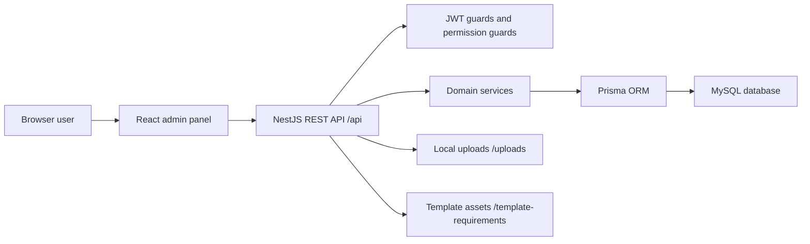

# Concordia PSH ERP - System Design and API Documentation

Version: 1.0
Date: 2026-08-08
Source code reviewed: `backend/src`, `backend/prisma/schema.prisma`, `admin-panel/config/apis.js`, `admin-panel/src/pages`

# Concordia PSH ERP - System Design, SRS, Backend, Database, and API Documentation

Version: 1.0  
Date: 2026-08-08  
Source code reviewed: `backend/src`, `backend/prisma/schema.prisma`, `admin-panel/config/apis.js`, `admin-panel/src/pages`

## 1. System Overview

Concordia PSH ERP is a web-based institute management system for Concordia College Peshawar. It provides one admin panel for operational, academic, financial, HR, hostel, attendance, examination, and configuration workflows.

The system has:

- React + Vite admin panel in `admin-panel`.
- NestJS REST API in `backend`.
- MySQL database accessed through Prisma ORM.
- Cookie-based JWT authentication with refresh token flow.
- File uploads for student/staff/teacher photos.
- Static file serving for uploads and template assets.
- HTML-template based printable documents for challans, ID cards, payroll, and reports.

## 3. System Architecture

### 3.1 High-Level Architecture

### 3.2 Backend Modules

- `AuthModule`: login, refresh, logout, current user.
- `AdminModule`: admin CRUD and teacher attendance administration.
- `DepartmentModule`: departments.
- `TeacherModule`: legacy teacher CRUD, subjects, classes, attendance.
- `AcademicsModule`: programs, classes, sections, subjects, sessions, mappings, timetable.
- `StudentModule`: students, status workflows, reports.
- `AttendanceModule`: student attendance, leaves, holidays, skips, generation, reports.
- `HrModule`: staff, employees, leave, payroll, staff attendance, holidays, advance salary, templates.
- `FrontOfficeModule`: inquiries, visitors, complaints, contacts.
- `ExaminationModule`: exams, marks, results, positions.
- `ConfigurationModule`: institute settings and templates.
- `HostelModule`: hostel registrations, rooms, allocations, expenses, inventory, challans.
- `InventoryModule`: school inventory and inventory expenses.
- `FeeManagementModule`: fee heads, structures, installments, challans, payments, reports, migration.
- `FinanceModule`: income, expense approvals, closings, reports.
- `DashboardModule`: dashboard KPIs and charts.
- `LocalFileModule`: local file upload/storage support.
- `PrismaModule`: database access.

### 3.3 Backend Runtime Configuration

- Nest app bootstrap in `backend/src/main.ts`.
- Global prefix: `/api`.
- Cookie parser enabled.
- BigInt JSON serialization patched to string.
- Global validation pipe:
  - `whitelist: true`
  - `forbidNonWhitelisted: true`
  - `transform: true`
- CORS:
  - origins: `http://localhost:5173`, `process.env.ALLOWED_IP`
  - credentials enabled
- Static serving:
  - `/uploads` from local upload root.
  - `/template-requirements` from backend template assets.

## 4. Database Design

### 4.1 Database Technology

- DBMS: MySQL.
- ORM: Prisma Client.
- Migrations: `backend/prisma/migrations`.
- Schema: `backend/prisma/schema.prisma`.

### 4.2 Core Entity Groups

#### Authentication and Users

- `admin`: admin login identity, role, permissions, approval relation, attendance marker relation.
- `Role`: `SUPER_ADMIN`, `ADMIN`.

#### Academic Structure

- `Department`: departments, HOD, staff, students, programs.
- `Program`: academic program with level, duration, roll prefix, department.
- `ProgramLevel`: `INTERMEDIATE`, `UNDERGRADUATE`, `COACHING`, `DIPLOMA`, `SHORT_COURSE`.
- `Class`: class/year/semester, program, sections, students, timetable, mappings.
- `Section`: section name, capacity, room, class.
- `AcademicSession`: named academic year/session, start/end dates, active flag.
- `Subject`: subject names and relations.
- `SubjectClassMapping`: subject assigned to class/session with credit hours/code.
- `TeacherSubjectMapping`: staff to subject.
- `TeacherClassSectionMapping`: staff to class/section/session.
- `ClassTimetable`: class/section/session timetable with JSON slots.
- `Assignment`: teacher, subject, section assignment records.

#### Student Records

- `Student`: identity, guardian, roll number, program/class/section/session, admission, fees, documents, status.
- `StudentAcademicRecord`: per-session class/section/program history.
- `StudentStatus`: `ACTIVE`, `EXPELLED`, `STRUCK_OFF`, `GRADUATED`.
- `StudentStatusHistory`: status transition audit.

#### Attendance and Leave

- `Attendance`: student attendance by class/section/subject/date/session.
- `AttendanceStatus`: present/absent/leave style student status enum.
- `AttendanceSkip`: skip generation/marking for class/section/subject/date/session.
- `Leave`: student leave requests and approval relation.
- `LeaveStatus`: leave workflow enum.
- `StaffAttendance`: staff attendance by staff/date/status and markedBy admin.
- `Holiday`: shared holiday calendar.

#### Staff, HR, Payroll

- `Staff`: teaching/non-teaching staff, identity, contact, department, salary, permissions, status.
- `StaffType`: `PERMANENT`, `CONTRACT`.
- `StaffStatus`: `ACTIVE`, `TERMINATED`, `RETIRED`.
- `EmployeeDepartment`: legacy non-teaching department enum.
- `EmploymentType`: legacy employment type enum.
- `StaffLeaveSettings`: sick/annual/casual leave limits and deductions.
- `StaffLeave`: staff leave records with type/status/lock/audit.
- `StaffLeaveType`: `CASUAL`, `SICK`, `ANNUAL`, `MATERNITY`, `PATERNITY`, `UNPAID`, `OTHER`.
- `StaffLeaveStatus`: `PENDING`, `APPROVED`, `REJECTED`, `CANCELLED`.
- `PayrollSettings`: global payroll settings.
- `Payroll`: generated payroll sheet rows.
- `PayrollPayment`: payroll payment transactions.
- `PayrollTemplate`: salary slip/payroll sheet HTML templates.
- `StaffIdSettings`: staff ID generation configuration.
- `AdvanceSalary`: staff advance salary with adjustment/audit fields.

#### Front Office

- `Inquiry`: inquiry/admission lead data, reference, status, session, student link.
- `InquiryStatus`: inquiry pipeline status.
- `InquiryType`: inquiry source/type.
- `Visitor`: visitor log.
- `Complaint`: complaint with type/status/assigned staff.
- `ComplaintType`: complaint category enum.
- `ComplaintStatus`: complaint workflow enum.
- `ComplaintRemark`: complaint discussion/audit comments.
- `Contact`: contact directory entries.
- `ContactCategory`: contact category enum.

#### Examination

- `Exam`: exam master, class/program/session.
- `ExamSchedule`: subject schedule for exam.
- `Marks`: marks per student/exam/subject.
- `Result`: computed result per student/exam.
- `Position`: class/section/student rank.
- `ReportCardTemplate`: report card HTML template.

#### Fees

- `FeeHead`: fee head master.
- `FeeStructure`: class/session fee structure.
- `FeeStructureHead`: fee structure breakdown.
- `FeeInstallment`: source of truth for student installment financial state.
- `InstallmentHead`: installment fee head breakdown.
- `FeeChallanV2`: challan snapshot document.
- `FeeChallanHead`: generated challan head snapshot.
- `ChallanPayment`: installment challan payment audit.
- `ExtraChallan`: standalone extra challan.
- `ExtraChallanHead`: extra challan breakdown.
- `ExtraChallanPayment`: extra challan payment audit.
- `FeeInstallmentStatus`: `PENDING`, `PARTIAL`, `PAID`, `VOID`, `SUPERSEDED`, `SETTLED`, `OVERDUE`.
- `FeeInstallmentChallanStatus`: same challan statuses.
- `ChallanTemplateType`: `INSTALLMENT`, `EXTRA`, `HOSTEL`.
- `FeeChallanTemplate`: challan HTML template by type.

#### Hostel/Boarding

- `HostelRegistration`: hostel student registration.
- `Room`: hostel room master.
- `RoomAllocation`: room allocation history.
- `HostelExpense`: hostel expense record.
- `HostelInventory`: hostel inventory record.
- `HostelChallan`: hostel fee challan with arrears and settlement fields.
- `HostelChallanHead`: hostel challan head breakdown.
- `HostelChallanPayment`: hostel challan payment audit.

#### Inventory

- `SchoolInventory`: school inventory items.
- `InventoryExpense`: expenses linked to inventory items.

#### Finance

- `FinanceIncome`: income ledger.
- `FinanceExpense`: expense ledger with approval/rejection metadata.
- `FinanceExpenseStatus`: `PENDING`, `APPROVED`, `REJECTED`.
- `FinanceClosing`: daily/monthly/custom period closing.

#### Configuration

- `InstituteSettings`: institute identity, contact, logo, challan prefix, late fee settings.
- `StaffIDCardTemplate`: staff ID card HTML templates.
- `StudentIDCardTemplate`: student ID card HTML templates.

### 4.3 Important Constraints and Indexes

- `admin.email` unique.
- `Department.name` unique.
- `Department.hodId` unique.
- `Program` unique by `[name, departmentId]`.
- `Class` unique by `[programId, year, semester]`.
- `Section` unique by `[classId, name]`.
- `AcademicSession.name` unique.
- `Staff.staffId`, `Staff.email`, `Staff.cnic` unique.
- `SubjectClassMapping` unique by `[subjectId, classId, sessionId]`.
- `Student.rollNumber` unique.
- `Student.inquiryId` unique.
- `TeacherSubjectMapping` unique by `[teacherId, subjectId]`.
- `TeacherClassSectionMapping` unique by `[teacherId, classId, sectionId, sessionId]`.
- `ClassTimetable` unique by `[classId, sectionId, sessionId]`.
- `FeeInstallment` unique by `[studentId, installmentNumber, sessionId]`.
- `FeeChallanV2.challanNumber` unique.
- `ExtraChallan.challanNumber` unique.
- `HostelChallan.challanNumber` unique.
- `FinanceClosing` unique by `[type, periodStart, periodEnd]`.

### 4.4 Data Ownership Rules

- `FeeInstallment` is the financial source of truth for student fee installments.
- `FeeChallanV2` is a generated snapshot for printing/payment record; it must not be used as the only financial source.
- Payment tables are append/audit tables and should not be deleted during normal financial correction flows.
- Student academic movement must create/update `StudentAcademicRecord` and `StudentStatusHistory`.
- Finance expense approval/rejection fields must preserve actor metadata.

## 5. API-Level Documentation

Common rules:

- Base URL: `http://localhost:3003/api`.
- Auth: cookie JWT. Most protected endpoints require `withCredentials: true`.
- Request body: JSON unless endpoint uses `multipart/form-data` for photo upload.
- Error format: Nest default HTTP error object unless service returns custom shape.
- Path parameters are marked with `:id` or named parameter.
- Query parameters are passed through controller `@Query()` where listed in controller.

### 5.1 Auth API

| Method | Endpoint | Auth | Purpose |
|---|---|---|---|
| POST | `/auth/create/super-admin` | Public/setup | Create initial super admin. |
| POST | `/auth/login` | Public | Login admin/staff and set tokens. |
| POST | `/auth/logout` | Cookie | Clear auth cookies/logout. |
| POST | `/auth/refresh-tokens` | Refresh token | Issue new access/refresh tokens. |
| GET | `/auth/user-who` | Access token | Return current authenticated user. |

### 5.2 Admin API

| Method | Endpoint | Auth | Purpose |
|---|---|---|---|
| GET | `/admin/get/admins` | Super admin | List admins. |
| PATCH | `/admin/update/admin` | Super admin | Update admin by query/body ID. |
| POST | `/admin/create/admin` | Super admin | Create admin. |
| DELETE | `/admin/remove/admin` | Super admin | Delete admin. |
| GET | `/admin/get/teacher/attendance` | Super admin + Teacher permission | Fetch teacher attendance. |
| PATCH | `/admin/mark/teacher` | Super admin + Teacher permission | Mark teacher attendance. |

### 5.3 Department API

| Method | Endpoint | Auth | Purpose |
|---|---|---|---|
| GET | `/department/get/names` | Public/implicit | List department names. |
| GET | `/department/get` | Public/implicit | List departments. |
| POST | `/department/create` | Public/implicit | Create department. |
| PATCH | `/department/update` | Public/implicit | Update department. |
| DELETE | `/department/remove` | Public/implicit | Delete department. |

### 5.4 Academics API

| Method | Endpoint | Purpose |
|---|---|---|
| GET | `/academics/program/get/all/names` | Program names for dropdowns. |
| GET | `/academics/program/get/all` | List programs. |
| POST | `/academics/program/create` | Create program. |
| PATCH | `/academics/program/update` | Update program. |
| DELETE | `/academics/program/remove` | Delete program. |
| GET | `/academics/class/get/all` | List classes. |
| POST | `/academics/class/create` | Create class. |
| PATCH | `/academics/class/update` | Update class. |
| DELETE | `/academics/class/remove` | Delete class. |
| GET | `/academics/section/get/all` | List sections. |
| POST | `/academics/section/create` | Create section. |
| PATCH | `/academics/section/update` | Update section. |
| DELETE | `/academics/section/remove` | Delete section. |
| GET | `/academics/subject/get/all` | List subjects, optionally by class. |
| POST | `/academics/subject/create` | Create subject. |
| PATCH | `/academics/subject/update` | Update subject. |
| DELETE | `/academics/subject/remove` | Delete subject. |
| GET | `/academics/tsm/get/all` | List teacher-subject mappings. |
| POST | `/academics/tsm/create` | Create teacher-subject mapping. |
| PATCH | `/academics/tsm/update` | Update teacher-subject mapping. |
| DELETE | `/academics/tsm/remove` | Delete teacher-subject mapping. |
| GET | `/academics/tcm/get/all` | List teacher-class-section mappings, optionally by session. |
| POST | `/academics/tcm/create` | Create teacher-class-section mapping. |
| PATCH | `/academics/tcm/update` | Update teacher-class-section mapping. |
| DELETE | `/academics/tcm/remove` | Delete teacher-class-section mapping. |
| GET | `/academics/scm/get/all` | List subject-class mappings, optionally by session. |
| GET | `/academics/scm/subjects-for-class` | List subjects assigned to class/session/section. |
| POST | `/academics/scm/create` | Create subject-class mapping. |
| PATCH | `/academics/scm/update` | Update subject-class mapping. |
| DELETE | `/academics/scm/remove` | Delete subject-class mapping. |
| GET | `/academics/staff/search` | Search staff for assignment. |
| POST | `/academics/tcm/assign-with-subjects` | Assign teacher to class/section with subjects. |
| GET | `/academics/timetable/get/all` | List timetables, optionally by session. |
| POST | `/academics/timetable/upsert` | Create/update timetable JSON slots. |
| DELETE | `/academics/timetable/remove` | Delete timetable. |
| GET | `/academics/session/get/all` | List academic sessions. |
| POST | `/academics/session/create` | Create academic session. |
| PATCH | `/academics/session/update` | Update academic session. |
| DELETE | `/academics/session/remove` | Delete academic session. |

### 5.5 Teacher API

| Method | Endpoint | Auth | Purpose |
|---|---|---|---|
| GET | `/teacher/get/names` | Public/implicit | List teacher names. |
| GET | `/teacher/get` | Public/implicit | List teachers. |
| POST | `/teacher/create` | Public/implicit, multipart optional | Create teacher/staff teaching profile with `photo`. |
| PATCH | `/teacher/update` | Public/implicit, multipart optional | Update teacher with `photo`. |
| DELETE | `/teacher/remove` | Public/implicit | Delete teacher. |
| GET | `/teacher/subjects` | Access token | List subjects for authenticated teacher. |
| GET | `/teacher/subjects/by-class` | Access token | List teacher subjects for class. |
| GET | `/teacher/get/classes` | Access token | List teacher classes. |
| GET | `/teacher/get/class/students/attendance` | Access token | Fetch class students and attendance. |
| PATCH | `/teacher/update/class/students/attendance` | Access token | Update class student attendance. |

### 5.6 Student API

| Method | Endpoint | Purpose |
|---|---|---|
| GET | `/student/get/all/passout` | List passout/non-active students with filters and pagination. |
| GET | `/student/get/all` | List active/all students with filters and pagination. |
| GET | `/student/search` | Search students. |
| GET | `/student/roll-number/latest` | Get latest roll number by prefix. |
| GET | `/student/:id` | Get student detail. |
| POST | `/student/create` | Create student, multipart optional `photo`. |
| PATCH | `/student/update` | Update student, multipart optional `photo`. |
| DELETE | `/student/remove` | Delete student. |
| PATCH | `/student/promote` | Promote student to next class/section/session. |
| PATCH | `/student/demote` | Demote student. |
| PATCH | `/student/passout` | Mark student graduated/passout. |
| PATCH | `/student/expel` | Mark student expelled with reason. |
| PATCH | `/student/struck-off` | Mark student struck off with reason. |
| PATCH | `/student/rejoin` | Rejoin inactive student. |
| GET | `/student/attendance/:id` | Get student attendance data. |
| GET | `/student/results/:id` | Get student result data. |
| GET | `/student/attendance-report/:id` | Get printable attendance report. |
| GET | `/student/result-report/:id` | Get printable result report. |

### 5.7 Attendance API

| Method | Endpoint | Auth | Purpose |
|---|---|---|---|
| POST | `/attendance/generate` | Access token | Generate attendance rows for class/section/subject/date/session. |
| GET | `/attendance/report` | Public/implicit | Attendance reports. |
| GET | `/attendance/student/fetch` | Access token | Fetch student attendance for marking. |
| PATCH | `/attendance/student/update` | Access token | Update student attendance. |
| DELETE | `/attendance/student/record` | Access token | Delete one student attendance record. |
| GET | `/attendance/leaves/get` | Public/implicit | List student leaves. |
| POST | `/attendance/leaves/create` | Public/implicit | Create student leave. |
| PATCH | `/attendance/leaves/update` | Access token + PermissionsGuard | Update student leave. |
| DELETE | `/attendance/leave` | Public/implicit | Delete student leave. |
| POST | `/attendance/holiday` | Public/implicit | Create holiday. |
| POST | `/attendance/skip` | Public/implicit | Create attendance skip. |
| DELETE | `/attendance/skip` | Public/implicit | Delete attendance skip. |
| GET | `/attendance/skip` | Public/implicit | List attendance skips. |

### 5.8 HR and Payroll API

| Method | Endpoint | Auth | Purpose |
|---|---|---|---|
| GET | `/hr/staff` | Public/implicit | List staff with filters. |
| GET | `/hr/staff-leaves` | Public/implicit | List staff leaves. |
| POST | `/hr/staff-leaves` | Access token | Create staff leave. |
| PATCH | `/hr/staff-leaves/:id` | Access token | Update staff leave. |
| DELETE | `/hr/staff-leaves/:id` | Public/implicit | Delete staff leave. |
| GET | `/hr/staff-leave-balance/:staffId` | Public/implicit | Get staff leave balance. |
| PATCH | `/hr/staff-leaves/:id/lock` | Access token | Lock staff leave. |
| PATCH | `/hr/staff-leaves/:id/status` | Access token | Approve/reject/cancel staff leave. |
| GET | `/hr/staff/:id` | Public/implicit | Get staff detail. |
| GET | `/hr/staff-id-settings` | Public/implicit | Get staff ID settings. |
| PATCH | `/hr/staff-id-settings` | Public/implicit | Update staff ID settings. |
| GET | `/hr/staff-id-preview` | Public/implicit | Preview staff ID generation. |
| POST | `/hr/staff` | Public/implicit, multipart optional | Create staff with `photo`. |
| PATCH | `/hr/staff/:id` | Public/implicit, multipart optional | Update staff with `photo`. |
| DELETE | `/hr/staff/:id` | Public/implicit | Delete staff. |
| GET | `/hr/get/employees` | Public/implicit | List legacy employees. |
| POST | `/hr/create/employee` | Public/implicit, multipart optional | Create legacy employee. |
| PATCH | `/hr/update/employee` | Public/implicit, multipart optional | Update legacy employee. |
| DELETE | `/hr/delete/employee` | Public/implicit | Delete legacy employee. |
| GET | `/hr/get/employees-by-dept` | Public/implicit | Get employees by department. |
| GET | `/hr/payroll-settings` | Public/implicit | Get payroll settings. |
| PATCH | `/hr/payroll-settings` | Public/implicit | Update payroll settings. |
| GET | `/hr/payroll-sheet` | Public/implicit | Get payroll sheet. |
| GET | `/hr/payroll-missing-staff` | Public/implicit | Get staff missing payroll for month. |
| POST | `/hr/payroll-generate` | Access token | Generate payroll. |
| GET | `/hr/payroll-history` | Public/implicit | List payroll history. |
| POST | `/hr/payroll` | Access token | Upsert payroll row. |
| POST | `/hr/payroll/:id/payment` | Access token | Record payroll payment. |
| GET | `/hr/leave-sheet` | Public/implicit | Get leave sheet. |
| POST | `/hr/leave` | Access token | Create legacy leave entry. |
| GET | `/hr/staff-attendance` | Public/implicit | List staff attendance. |
| POST | `/hr/staff-attendance` | Access token | Mark staff attendance. |
| POST | `/hr/staff-attendance/bulk` | Access token | Bulk mark staff attendance. |
| DELETE | `/hr/staff-attendance/record` | Access token | Delete one staff attendance record. |
| DELETE | `/hr/staff-attendance` | Public/implicit | Delete staff attendance. |
| DELETE | `/hr/staff-attendance/by-date` | Public/implicit | Delete all staff attendance for date. |
| POST | `/hr/holidays` | Public/implicit | Create HR holiday. |
| GET | `/hr/holidays` | Public/implicit | List HR holidays. |
| DELETE | `/hr/holidays` | Public/implicit | Delete HR holiday. |
| POST | `/hr/advance-salary` | Access token | Create advance salary. |
| GET | `/hr/advance-salary` | Public/implicit | List advance salaries. |
| PATCH | `/hr/advance-salary` | Access token | Update advance salary. |
| DELETE | `/hr/advance-salary` | Public/implicit | Delete advance salary. |
| GET | `/hr/attendance-summary` | Public/implicit | Get attendance summary. |
| GET | `/hr/reports/analytics` | Public/implicit | HR reports analytics. |
| POST | `/hr/payroll-template` | Public/implicit | Create payroll template. |
| GET | `/hr/payroll-template` | Public/implicit | List payroll templates. |
| PATCH | `/hr/payroll-template` | Public/implicit | Update payroll template. |
| DELETE | `/hr/payroll-template` | Public/implicit | Delete payroll template. |

### 5.9 Front Office API

| Method | Endpoint | Auth | Purpose |
|---|---|---|---|
| GET | `/front-office/get/inquiries` | Public/implicit | List inquiries with filters. |
| POST | `/front-office/create/inquiry` | Public/implicit | Create inquiry. |
| PATCH | `/front-office/update/inquiry` | Public/implicit | Update inquiry. |
| DELETE | `/front-office/delete/inquiry` | Public/implicit | Delete inquiry. |
| POST | `/front-office/inquiry/:id/remark` | Access token | Add inquiry remark. |
| POST | `/front-office/create/visitor` | Public/implicit | Create visitor. |
| GET | `/front-office/get/visitors` | Public/implicit | List visitors. |
| PATCH | `/front-office/update/visitor` | Public/implicit | Update visitor. |
| DELETE | `/front-office/delete/visitor` | Public/implicit | Delete visitor. |
| POST | `/front-office/create/complaint` | Public/implicit | Create complaint. |
| GET | `/front-office/get/complaints` | Public/implicit | List complaints. |
| GET | `/front-office/get/my-complaints` | Access token | List complaints assigned to/requested by current user. |
| POST | `/front-office/complaint/:id/remark` | Access token | Add complaint remark. |
| PATCH | `/front-office/update/complaint` | Public/implicit | Update complaint. |
| DELETE | `/front-office/delete/complaint` | Public/implicit | Delete complaint. |
| POST | `/front-office/create/contact` | Public/implicit | Create contact. |
| PATCH | `/front-office/update/contact` | Public/implicit | Update contact. |
| DELETE | `/front-office/delete/contact` | Public/implicit | Delete contact. |
| GET | `/front-office/get/contacts` | Public/implicit | List contacts. |

### 5.10 Examination API

| Method | Endpoint | Auth | Purpose |
|---|---|---|---|
| POST | `/exams` | Access token | Create exam. |
| GET | `/exams` | Access token | List exams. |
| PATCH | `/exams/:id` | Access token | Update exam. |
| DELETE | `/exams/:id` | Access token | Delete exam. |
| POST | `/exams/marks` | Access token | Create marks. |
| POST | `/exams/marks/bulk` | Access token | Bulk create/update marks. |
| GET | `/exams/marks` | Access token | List marks with filters. |
| PATCH | `/exams/marks/:id` | Access token | Update marks. |
| DELETE | `/exams/marks/delete` | Public/implicit | Delete marks by query/body. |
| POST | `/exams/result/create` | Public/implicit | Create result. |
| GET | `/exams/result/all` | Access token | List results. |
| POST | `/exams/result/generate` | Public/implicit | Generate result. |
| PATCH | `/exams/result/update` | Public/implicit | Update result. |
| DELETE | `/exams/result/delete` | Public/implicit | Delete result. |
| GET | `/exams/result/student` | Public/implicit | Get student result. |
| POST | `/exams/positions/generate` | Public/implicit | Generate positions. |
| GET | `/exams/positions/all` | Access token | List positions. |
| PATCH | `/exams/positions/update` | Public/implicit | Update position. |
| DELETE | `/exams/positions/delete` | Public/implicit | Delete position. |

### 5.11 Fee API - New Installment/Challan Surface

| Method | Endpoint | Auth | Purpose |
|---|---|---|---|
| GET | `/fee/installments` | Public/implicit | List installments by filters such as student/class/session/status. |
| GET | `/fee/installments/:id` | Public/implicit | Get installment detail. |
| PATCH | `/fee/installments/:id` | Public/implicit | Update installment financial fields. |
| POST | `/fee/installments/bulk-create` | Public/implicit | Bulk create installments. |
| POST | `/fee/challans/generate` | Public/implicit | Generate one installment challan. |
| POST | `/fee/challans/bulk-generate` | Public/implicit | Generate challans in bulk. |
| POST | `/fee/challans/extra` | Public/implicit | Generate dedicated extra challan. |
| POST | `/fee/challans/bulk-generate-extra` | Public/implicit | Bulk generate extra challans. |
| GET | `/fee/challans/extra/list` | Public/implicit | List dedicated extra challans. |
| GET | `/fee/challans/extra/:id/print` | Public/implicit | Print extra challan. |
| PATCH | `/fee/challans/extra/:id` | Public/implicit | Update extra challan. |
| DELETE | `/fee/challans/extra/:id` | Public/implicit | Delete extra challan. |
| POST | `/fee/challans/extra/:id/pay` | Public/implicit | Record extra challan payment. |
| GET | `/fee/challans/:id` | Public/implicit | Get installment challan. |
| PATCH | `/fee/challans/:id/void` | Public/implicit | Void installment challan. |
| GET | `/fee/challans/:id/print` | Public/implicit | Print installment challan. |
| POST | `/fee/payments` | Access token | Record installment challan payment. |
| GET | `/fee/payments` | Public/implicit | List payment history. |
| GET | `/fee/reports/summary` | Public/implicit | Fee summary report. |
| GET | `/fee/reports/revenue-over-time` | Public/implicit | Fee revenue over time. |
| GET | `/fee/reports/class-stats` | Public/implicit | Class-level fee stats. |
| GET | `/fee/reports/analytics` | Public/implicit | Fee analytics report. |
| GET | `/fee/settings` | Public/implicit | Get fee settings. |
| PATCH | `/fee/settings` | Public/implicit | Update fee settings. |
| POST | `/fee/migration/run` | Public/implicit | Run fee migration. |
| GET | `/fee/migration/stats` | Public/implicit | Get migration stats. |

### 5.12 Fee Management API - Legacy/Configuration Surface

| Method | Endpoint | Purpose |
|---|---|---|
| POST | `/fee-management/head/create` | Create fee head. |
| GET | `/fee-management/head/get/all` | List fee heads. |
| PATCH | `/fee-management/head/update` | Update fee head. |
| DELETE | `/fee-management/head/delete` | Delete fee head. |
| POST | `/fee-management/structure/create` | Create fee structure. |
| GET | `/fee-management/structure/get/all` | List fee structures. |
| PATCH | `/fee-management/structure/update` | Update fee structure. |
| DELETE | `/fee-management/structure/delete` | Delete fee structure. |
| GET | `/fee-management/reports/revenue-over-time` | Legacy revenue over time report. |
| GET | `/fee-management/reports/class-collection` | Legacy class collection report. |
| GET | `/fee-management/reports/collection-summary` | Legacy collection summary. |
| GET | `/fee-management/challan/get/all` | List legacy challans. |
| GET | `/fee-management/challan/bulk` | Bulk challan retrieval/operation. |
| DELETE | `/fee-management/challan/delete` | Delete legacy challan. |
| PATCH | `/fee-management/challan/update` | Update legacy challan. |
| GET | `/fee-management/challan/history` | Student challan/payment history. |
| GET | `/fee-management/student/summary` | Student fee summary. |
| GET | `/fee-management/student/arrears` | Student arrears. |
| GET | `/fee-management/installment-plans` | List installment plans. |
| POST | `/fee-management/template/create` | Create challan template. |
| GET | `/fee-management/template/get/all` | List challan templates. |
| GET | `/fee-management/template/get/by-id` | Get challan template by ID. |
| GET | `/fee-management/template/get/default` | Get default challan template. |
| PATCH | `/fee-management/template/update` | Update challan template. |
| DELETE | `/fee-management/template/delete` | Delete challan template. |
| POST | `/fee-management/extra-challan/create` | Create/bulk create extra challan legacy flow. |
| GET | `/fee-management/extra-challan/get/all` | List extra challans legacy flow. |
| DELETE | `/fee-management/extra-challan/delete` | Delete extra challan legacy flow. |
| PATCH | `/fee-management/extra-challan/update` | Update extra challan legacy flow. |

### 5.13 Hostel API

| Method | Endpoint | Purpose |
|---|---|---|
| POST | `/hostel/registrations` | Create hostel registration. |
| GET | `/hostel/registrations` | List hostel registrations. |
| GET | `/hostel/registrations/by-student/:studentId` | Get hostel registrations by student. |
| GET | `/hostel/registrations/:id` | Get hostel registration. |
| PATCH | `/hostel/registrations/:id` | Update hostel registration. |
| DELETE | `/hostel/registrations/:id` | Delete hostel registration. |
| PATCH | `/hostel/registrations/:id/terminate` | Terminate hostel registration. |
| PATCH | `/hostel/registrations/:id/withdraw` | Withdraw hostel registration. |
| PATCH | `/hostel/registrations/:id/readmit` | Readmit hostel registration. |
| GET | `/hostel/registrations/:id/history` | Registration history. |
| POST | `/hostel/rooms` | Create room. |
| GET | `/hostel/rooms` | List rooms. |
| GET | `/hostel/rooms/:id` | Get room. |
| PATCH | `/hostel/rooms/:id` | Update room. |
| DELETE | `/hostel/rooms/:id` | Delete room. |
| POST | `/hostel/allocations` | Allocate room. |
| DELETE | `/hostel/allocations/:id` | Delete/deallocate room allocation. |
| POST | `/hostel/expenses` | Create hostel expense. |
| GET | `/hostel/expenses` | List hostel expenses. |
| GET | `/hostel/expenses/:id` | Get hostel expense. |
| PATCH | `/hostel/expenses/:id` | Update hostel expense. |
| DELETE | `/hostel/expenses/:id` | Delete hostel expense. |
| POST | `/hostel/inventory` | Create hostel inventory item. |
| GET | `/hostel/inventory` | List hostel inventory. |
| GET | `/hostel/inventory/:id` | Get hostel inventory item. |
| PATCH | `/hostel/inventory/:id` | Update hostel inventory item. |
| DELETE | `/hostel/inventory/:id` | Delete hostel inventory item. |
| GET | `/hostel/room/by-student/:studentId` | Current room by student. |
| POST | `/hostel/challans` | Create hostel challan. |
| GET | `/hostel/challans` | List hostel challans. |
| PATCH | `/hostel/challans/:id` | Update hostel challan. |
| DELETE | `/hostel/challans/:id` | Delete hostel challan. |
| GET | `/hostel/registrations-search` | Search hostel registrations. |
| GET | `/hostel/registrations/:id/payments` | Payments for hostel registration. |
| GET | `/hostel/challans/:id/print` | Print hostel challan. |
| POST | `/hostel/challans/:id/payment` | Record hostel challan payment. |
| GET | `/hostel/revenue` | Hostel revenue summary. |
| GET | `/hostel/reports/analytics` | Hostel analytics. |
| POST | `/hostel/registrations/:id/payments` | Create direct hostel registration payment. |

### 5.14 Inventory API

| Method | Endpoint | Purpose |
|---|---|---|
| GET | `/inventory/items` | List school inventory items. |
| GET | `/inventory/items/:id` | Get inventory item. |
| POST | `/inventory/items` | Create inventory item. |
| PATCH | `/inventory/items/:id` | Update inventory item. |
| DELETE | `/inventory/items/:id` | Delete inventory item. |
| GET | `/inventory/expenses` | List inventory expenses. |
| GET | `/inventory/expenses/item/:itemId` | List expenses for one item. |
| POST | `/inventory/expenses` | Create inventory expense. |
| PATCH | `/inventory/expenses/:id` | Update inventory expense. |
| DELETE | `/inventory/expenses/:id` | Delete inventory expense. |

### 5.15 Finance API

All finance routes use `JwtAccGuard` at controller level.

| Method | Endpoint | Purpose |
|---|---|---|
| POST | `/finance/income` | Create income. |
| GET | `/finance/income` | List income with filters. |
| PATCH | `/finance/income/:id` | Update income. |
| DELETE | `/finance/income/:id` | Delete income. |
| POST | `/finance/expense` | Create expense as pending/with creator metadata. |
| GET | `/finance/expense` | List expenses with filters/status. |
| PATCH | `/finance/expense/:id` | Update expense. |
| DELETE | `/finance/expense/:id` | Delete expense. |
| PATCH | `/finance/expense/:id/approve` | Approve expense. |
| PATCH | `/finance/expense/:id/reject` | Reject expense with reason. |
| POST | `/finance/closing` | Create finance closing. |
| GET | `/finance/closing` | List closings. |
| PATCH | `/finance/closing/:id` | Update closing. |
| DELETE | `/finance/closing/:id` | Delete closing. |
| GET | `/finance/dashboard-stats` | Finance dashboard KPIs. |
| GET | `/finance/reports/analytics` | Finance analytics report. |

### 5.16 Configuration API

| Method | Endpoint | Purpose |
|---|---|---|
| GET | `/configuration/institute-settings` | Get institute settings. |
| PATCH | `/configuration/institute-settings` | Update institute settings. |
| POST | `/configuration/report-card-templates` | Create report card template. |
| GET | `/configuration/report-card-templates/default` | Get default report card template. |
| GET | `/configuration/report-card-templates` | List report card templates. |
| GET | `/configuration/report-card-templates/:id` | Get report card template. |
| PATCH | `/configuration/report-card-templates/:id` | Update report card template. |
| DELETE | `/configuration/report-card-templates/:id` | Delete report card template. |
| POST | `/configuration/staff-id-card-templates` | Create staff ID card template. |
| GET | `/configuration/staff-id-card-templates/default` | Get default staff ID card template. |
| GET | `/configuration/staff-id-card-templates` | List staff ID card templates. |
| GET | `/configuration/staff-id-card-templates/:id` | Get staff ID card template. |
| PATCH | `/configuration/staff-id-card-templates/:id` | Update staff ID card template. |
| DELETE | `/configuration/staff-id-card-templates/:id` | Delete staff ID card template. |
| POST | `/configuration/student-id-card-templates` | Create student ID card template. |
| GET | `/configuration/student-id-card-templates/default` | Get default student ID card template. |
| GET | `/configuration/student-id-card-templates` | List student ID card templates. |
| GET | `/configuration/student-id-card-templates/:id` | Get student ID card template. |
| PATCH | `/configuration/student-id-card-templates/:id` | Update student ID card template. |
| DELETE | `/configuration/student-id-card-templates/:id` | Delete student ID card template. |

### 5.17 Dashboard API

All dashboard routes use `JwtAccGuard`.

| Method | Endpoint | Purpose |
|---|---|---|
| GET | `/dashboard/stats` | Top-level dashboard stats. |
| GET | `/dashboard/students` | Student dashboard stats. |
| GET | `/dashboard/fees` | Fee dashboard stats. |
| GET | `/dashboard/attendance` | Attendance dashboard stats. |
| GET | `/dashboard/staff` | Staff dashboard stats. |
| GET | `/dashboard/finance` | Finance dashboard stats. |
| GET | `/dashboard/charts` | Dashboard chart data. |

### 5.18 Cloudinary API

`cloudinary.controller.ts` exposes controller prefix `/cloudinary`, but no active route decorators were found. Cloudinary service/module exist for image upload integration support.

## 6. Frontend Modules and Functionality

### 6.1 React App Structure

- `App.jsx`: route setup, auth refresh/current user checks.
- `DashboardLayout.jsx`: navigation shell, logout, permissions-aware menu.
- `PermissionRoute.jsx`: permission-gated routing.
- `config/apis.js`: central API client functions.

### 6.2 Pages

- `Login.jsx`: login workflow.
- `Dashboard.jsx`: dashboard KPIs and charts.
- `Academics.jsx`: programs, classes, sections, subjects, sessions, mappings, timetable.
- `Students.jsx`: student CRUD, status workflows, reports, attendance/results tabs.
- `Teachers.jsx`: teacher CRUD and mappings.
- `Attendance.jsx`: student attendance generation, marking, reports, skips.
- `FrontOffice.jsx`: inquiries, visitors, complaints, contacts.
- `Examination.jsx`: exams, marks, results, positions.
- `FeeManagement.jsx`: fee heads, structures, installments, challans, payments, reports.
- `Boarding.jsx`: hostel registration, rooms, allocation, inventory, expenses, hostel fees.
- `HRPayroll.jsx`: staff, payroll, leaves, staff attendance, holidays, advance salary.
- `Finance.jsx`: income, expense approval, closings, analytics.
- `Inventory.jsx`: school inventory and expenses.
- `Configuration.jsx`: institute settings, templates, ID cards, report cards.
- `Complaints.jsx`: user-specific complaint view.
- `Staff.jsx`: staff management workflow.
- `NotFound.jsx`: fallback route.

## 7. Key Workflows

### 7.1 Admission to Student

1. Front office creates inquiry.
2. Inquiry can receive remarks/follow-ups.
3. Student is created, optionally linked to inquiry.
4. Student gets department/program/class/section/session assignment.
5. Academic record is created/current.
6. Fee installments are bulk-created for the student.

### 7.2 Attendance Marking

1. Admin/teacher selects class, section, subject, date, session.
2. Attendance generation creates missing rows.
3. User fetches rows.
4. User marks present/absent/leave.
5. Reports aggregate by student/class/date range.
6. Skips and holidays prevent invalid generation.

### 7.3 Fee Collection

1. Fee heads and structures are configured.
2. Installments are generated for student/session.
3. Challan is generated from installment snapshot.
4. Payment is recorded against challan.
5. Installment financial state updates paid/pending/settled.
6. Arrears carry forward when needed.
7. Reports read installment/payment state.

### 7.4 Hostel Fee Collection

1. Student receives hostel registration.
2. Room is allocated.
3. Hostel challan is generated with heads and due date.
4. Payment is recorded.
5. Arrears/settlement fields preserve chain.
6. Revenue and analytics use challan/payment records.

### 7.5 Payroll

1. Staff records and payroll settings exist.
2. Payroll sheet generated for month.
3. Missing staff payroll view identifies gaps.
4. Payroll is generated or upserted.
5. Payment is recorded.
6. Payroll history and templates support slips/sheets.

### 7.6 Finance Expense Approval

1. User creates expense.
2. Expense starts as pending.
3. Authorized user approves or rejects.
4. Approval/rejection actor metadata and timestamps are stored.
5. Analytics and closings use approved financial records.

## 8. Security Design

- JWT access token protects sensitive endpoints.
- JWT refresh token only refreshes auth state.
- Admin role authorization protects admin CRUD and teacher attendance admin routes.
- JSON permissions support module/submodule access in UI and backend guards.
- CORS uses explicit origins and credentials.
- ValidationPipe blocks unknown DTO fields where DTOs are used.
- File upload is centralized through image upload options and local file service.

## 9. Error and Validation Design

- Backend uses Nest validation errors for DTO validation.
- Prisma unique/foreign key errors should be surfaced as HTTP errors by services.
- Frontend API wrapper returns thrown Axios errors; UI pages show toast/error states.
- For file uploads, invalid file type/size should be blocked by upload middleware/options.

## 10. Deployment Design

- Backend Dockerfile builds/runs Nest app.
- Admin panel Dockerfile builds frontend.
- `docker-compose.yml` orchestrates app containers.
- Required backend environment:
  - `DATABASE_URL`
  - `PORT`
  - JWT secrets/config used by auth module
  - `ALLOWED_IP`
  - Upload/template paths as configured by code

## 11. Testing and Quality

Existing tests include:

- Backend unit/e2e specs for controllers/services.
- HR service/controller/helper tests.
- Fee regression notes/tests for frozen amounts and settlement tracking.
- Frontend tests for attendance generation/session filters, staff validation/errors, leaves, hostel tracking, fee challan display, academic mappings, examination filters, and input validation.

Recommended minimum verification before release:

- Backend: `npm test`, `npm run test:e2e`, `npm run build`.
- Frontend: `npm test`, `npm run build`.
- Database: `npx prisma validate`, `npx prisma migrate status`.

## 12. Open Technical Risks

- Some controller endpoints are public/implicit because decorators are absent; decide which must require `JwtAccGuard`.
- Legacy fee endpoints and new `/fee` endpoints overlap; keep compatibility, but document source-of-truth rules clearly for finance team.
- Cloudinary module exists but controller has no active routes; remove or complete routes.
- Frontend API base URL is hardcoded to localhost in `admin-panel/config/apis.js`; production should use environment config.
- Some legacy teacher/employee endpoints overlap with HR staff model; future refactor should converge them carefully.

